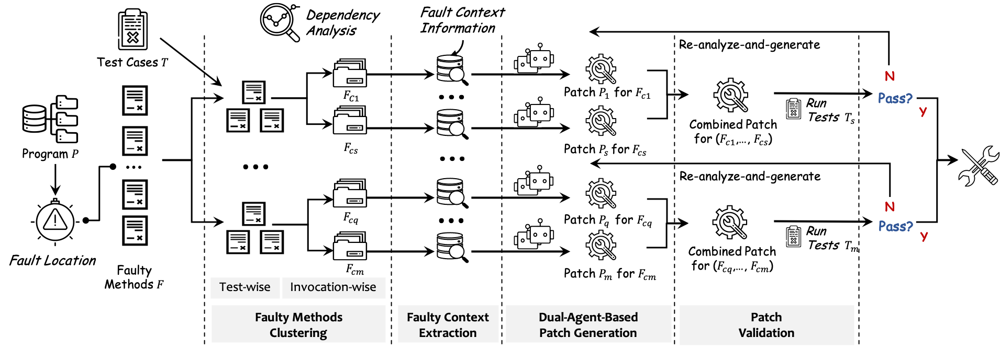

# PReMM: LLM-Based Program Repair for Multi-Method Bugs via Divide and Conquer
[](https://doi.org/10.5281/zenodo.16927560)
---
## Video
<video src="演示视频.mov" width="800" controls>
</video>

## 1. Introduction

PReMM, an LLM-based program repair framework for Multi-Method Bugs.  PReMM builds on three core components:
the faulty method clustering component to partition the faulty methods into clusters based on the dependence relationship among them,
enabling a divide-and-conquer strategy for the repairing task;
the fault context extraction component to gather extra information about the fault context which can be utilized to better guide the diagnosis of the fault and the generation of correct patches;
the dual-agent-based patch generation component that employs two LLM-based agents with different roles to analyze the fault more precisely and generate patches of higher-quality.



Fig.1 Overview of PReMM

The purpose of this artifact is to support the claims made in our paper titled "PReMM: LLM-Based Program Repair for Multi-Method Bugs via Divide and Conquer". The artifact provides an implementation of `PReMM`, enabling reproducibility and facilitating further research and development based on our work.

```
PReMM
├── Config
│   ├── defects4j_environment.json
│   ├── gitbug_java_environment.json
│   ├── llm_config.json
│   └── prompt.py
├── Overview.pdf
├── Overview.png
├── PReMM-gitbug.zip
├── README.md
├── Results.zip
├── baselines.zip
├── basic_framework
│   ├── __init__.py
│   ├── agent_state.py
│   ├── all_enum.py
│   ├── main_edge.py
│   ├── main_graph.py
│   ├── main_nodes.py
│   ├── program_analysis.py
│   ├── prompt.py
│   ├── repair_edge.py
│   ├── repair_graph.py
│   └── repair_nodes.py
├── benchmark
│   ├── __init__.py
│   ├── benchmark.py
│   ├── defects4j.py
│   ├── gitbug_java.py
│   └── new_benchmark.py
├── datasets
│   ├── defects4j-trans
│   ├── defects4jv1.2
│   ├── defects4jv2
│   └── gitbug-java
├── java_lib
│   └── context-extractor.jar
├── logger.py
├── output.zip
├── poetry.lock
├── pyproject.toml
├── run.py
└── utils.py

```

### Overview of the Artifact

The Artifact implementation consists of two integrated components:

- **Python Repair Framework**: The primary repair pipeline
- **Java Program Analysis Module**: Handles static analysis tasks (packaged in `java-lib/context-extractor.jar`)

#### Key Integration Points

The Java analysis module is invoked by Python through two interfaces in `basic_framework/program_analysis.py`:

1. `program_analysis_repository()`: Performs core dependency analysis
   - Inputs:
     - `root_dir`: Repository root (e.g., `/tmp/Chart-1`)
     - `source_dir`: Source code directory (e.g., `source`)
     - `class_dir`: Compiled classes path (e.g., `build/classes`)
     - `fault_loc_file`: File containing fault locations (e.g., `datasets/defects4jv1.2/fault_location/defects4j/chart/1`)
     - `test_build_dir`: Test classes path (e.g., `build/test`)
     - `test_names`: List of failing tests (e.g., `["com.google.javascript.jscomp.ClosureReverseAbstractInterpreterTest::testGoogIsArray2"]`)
   - Outputs:
     - `signature_method_map`: Faulty method signatures mapped to metadata (line ranges) and `similar_codes` (possibly empty if no similar implementations exist).
     - `methods_tests_map`: Invocation-wise groupings of faulty methods to their covering test cases
     - `method_test_path_map`: Invocation chains from tests to faulty methods (per method signature)
2. `key_token_mining()`: Extracts critical tokens for repair
   - Inputs:
     - `root_dir`: Repository root (e.g., `/tmp/Chart-1`)
     - `file_path`: Target analysis file path
   - Output
     - `key_tokens`: key tokens mined in the current file.

#### Analysis Module Functionality

The Java component (`context-extractor.jar`) handles:

- Faulty Method Clustering:
  - Call graph construction
  - Dependency analysis for faulty methods/tests
- Fault Context Extraction:
  - Test-to-method invocation chain extraction
  - Project-wide similar code search
  - Key token mining

#### Python Repair Framework

- Core Responsibilities:
  - Orchestrating the overall repair pipeline
  - Patch generation using a dual-agent approach
  - Integration with external tools and modules
- Key Files
  - `main_graph.py`, `main_nodes.py`, `main_edge`: Implements the primary workflow (Fig. 1 pipeline)
  - `repair_graph.py`, `repair_nodes.py`,`repir_edge.py`: Dual-Agent patch generation for each invocation-wise faulty method group

### Supported Claims from the Paper

| Claim                       | Paper Section | Status    | Supporting Artifact          | Artifact Location                                | Notes                                                                                                |
| --------------------------- | ------------- | --------- | ---------------------------- | ------------------------------------------------ | ---------------------------------------------------------------------------------------------------- |
| Faulty Method Clustering    | 3.1           | Supported | DependencyAnalysis.java      | java_lib/context-extractor.jar                   | Implements repository call graph construction, test-wise clustering, and invocation-wise clustering. |
| Invocation Chain Extraction | 3.2           | Supported | DependencyAnalysis.java      | java_lib/context-extractor.jar                   | Extracts test-to-method invocation chains stored in method_test_path_map                             |
| Similar Code Search         | 3.2           | Supported | Searcher.java                | java_lib/context-extractor.jar                   | Finds project-wide similar implementations for faulty methods                                        |
| Key Token Mining            | 3.2           | Supported | ProgramAnalysis.java         | java_lib/context-extractor.jar                   | Implements signaturesMining in ProgramAnalysis.java                                                  |
| Dual-Agent Patch Generation | 3.3           | Supported | Repair Orchestration Modules | repair_graph.py, repair_nodes.py, repair_edge.py | Implements cooperative agent framework for patch generation per invocation-wise group                |

## 2. Hardware Dependencies

To fully evaluate the artifact, the following hardware is required:

- **Processor**: Minimum Intel i5 or equivalent (for basic evaluation), recommended: Intel i7 or better
- **RAM**: At least 8 GB (16 GB recommended)
- **GPU**: No need
- **Disk Space**: At least 10 GB of free space
- **Operating System**: Linux (Ubuntu 20.04+ preferred), macOS (10.14+)

## 3. Getting Started Guide

This guide will help you set up the environment and run a basic test case. Estimated time: 30 minutes.

### Prerequisites

- JDK 1.7 and JDK 1.8
- Python 3.10
- Conda (Miniconda or Anaconda)
- Internet access for downloading dependencies and LLM APIs

### Steps

#### Setup Java Environment

- The Java component (`context-extractor.jar`) requires JDK 8 to run.
- Install JDK 8 (if regenerating analysis data)

  Download from: https://www.oracle.com/java/technologies/javase/javase8u211-later-archive-downloads.html
- JDK 8 Environment

  - Set the environment variable `JAVA_HOME` to the path of the JDK 8 installation directory.

#### Set Up Conda Environment

```shell
conda create -n premm_env python=3.10
conda activate premm_env
```

#### Install Poetry

We provide a `poetry` configuration file (`pyproject.toml`) for PReMM to install dependencies.

```shell
pip install poetry
```

1. Configure Poetry to use the current Python environment:

```shell
poetry env use python3
```

2. Install project dependencies:

```shell
poetry install --no-root
```

### Dataset Preparation

#### Defects4J v1.2

- Install Defects4Jv1.4.0 (a more stable version of v1.2) from https://github.com/rjust/defects4j/tags
- JDK 1.7 for Defects4Jv1.4
  Install JDK1.7 from https://www.oracle.com/java/technologies/javase/javase7-archive-downloads.html
- Defects4Jv1.4 Initialization

```shell
wget https://github.com/rjust/defects4j/releases/download/v1.4.0/defects4j-1.4.0.zip
unzip defects4j-1.4.0.zip
cd defects4j-1.4.0
./init.sh
```

#### Defects4J v2.0

- Install Defects4Jv2.0.1 from https://github.com/rjust/defects4j/tags
- JDK 1.8 for Defects4Jv2.0
  Install JDK1.8 from https://www.oracle.com/java/technologies/javase/javase8u211-later-archive-downloads.html
- Defects4Jv2.0 Initialization

```shell
wget https://github.com/rjust/defects4j/releases/download/v2.0.1/defects4j-2.0.1.zip
unzip defects4j-2.0.1.zip
cd defects4j-2.0.1
./init.sh
```

## 4. Step-by-Step Instructions

This section details how to reproduce the core experiments described in the paper.

### Configuration

#### Datasets Configuration

Modify the `Config/defects4j_enviroment.json`

```python
{
  "JAVA_7_HOME": "<Your own path>", 
  "JAVA_8_HOME": "<Your own path>",
  "Defects4J_DIR": "<Your own path>", #.../defects4j-1.4.0
  "Defects4J_V2_DIR": "<Your own path>", #.../defects4j-2.0.1
  "TEMP_DIR": "/tmp" # working_dir
}
```

#### LLM Configuration

Since PReMM is an LLM-based tool, you can choose the following LLMs and enter your own api key.
You can also choose other LLMs by modifying the `Config/llm_config.json`, adding a new LLM to the `Config/llm_config.json` file.

In our work, we use Qwen2.5-72B as our LLM.

```python
{
    "DeepSeek-V3": {
        "api_key": "<Your own api key>",
        "model_name": "deepseek-chat",
        "base_url": "https://api.deepseek.com/v1"
    },
    "Qwen2.5-32B":{
        "api_key": "<Your own api key>",
        "model_name": "qwen2.5-32b-instruct",
        "base_url": "https://dashscope.aliyuncs.com/compatible-mode/v1"
    },
    "Qwen2.5-72B":{
        "api_key": "<Your own api key>",
        "model_name": "qwen2.5-72b-instruct",
        "base_url": "https://dashscope.aliyuncs.com/compatible-mode/v1"
    },
    "Your LLM":{
      "api_key": "<Your own api key>",
        "model_name": "<Your model name>",
          "base_url": "<Your model base url>"
    },
    "CurrentLLM": "Qwen2.5-72B"
}
```

PReMM tool is invoked using the command line interface offered by `run.py`.

### The command line arguments

- `--dataset` , the current dataset you are target to repair, e.g., `defects4jv1.2` or `defects4jv2`.
- `--bug_id`, the target bug that you want to repair, e.g., `Chart-1`. If you want to repair all the bugs in the dataset, set it to `all`.
- `--chain_length` , the maximum iterative number, default is 5.
- `-f`, flag that enable faulty methods clustering.
- `-c`, flag that enable context extraction.
- `-d`, flag that enable dual-agent-based patch generation.

### Plausible patches generation

```shell
poetry run python run.py --dataset defects4jv1.2 --bug_id Lang-7 -f -c -d --chain_length 5
```

### Output

After running PReMM, your output directory structure should be like the following:

```
output
└── Qwen2.5-72B-Local
    └── PReMM
        └── defects4jv1.2
            └── Lang-7
                ├── Lang-7-5.java
                ├── Lang-7-5.log
                ├── patch-5.diff
                └── repair_result-5.csv


```

- If the final patch generated by PReMM pass all the test cases, we consider it as a plausible patch, and will store the patch in `output/{model_name}/PReMM/defects4jv1.2/bug_id/patch-{Chain_Length}.diff`,e.g., `Lang-7/patch-{Chain_Length}.diff`
- All the repair process of PReMM are stored in `Lang-7-{Chain_Length}.log`
- We also stores additional information in `repair_results-{Chain_Length}.scv`
  - **Bug_id**: The target bug id
  - **Repair_Result**: Indicates whether the patch was successfully repaired or not.
  - **Attempt Number**: Indicates how many attempts were made to generate a valid patch.
  - **Iteration Number**: Indicates how many iterations were needed to generate the valid patch (e.g., `1` means successful repair in first iteration of the Dul-LLM-agent).
  - **Last Attempt Token Usage**: Records both:
    - Total input tokens consumed by LLMs
    - Total output tokens produced by LLMs
  - **Token Usage**: Records both:
    - Total input tokens consumed by LLMs
    - Total output tokens produced by LLMs

#### Analysis Directory

The directory structure for the static analysis results is as follows:

```shell
analysis_output
└── defects4jv1.2
    └── Lang-7
        ├── method_test_path_map.pickle
        ├── methods_tests_map.pickle
        ├── signature_method_map.pickle
        └── test_cases_codes_map.pickle
```

- `method_test_path_map.pickle`: Invocation chains from tests to faulty methods (per method signature).
- `methods_tests_map.pickle`: Invocation-wise groupings of faulty methods to their covering test cases.
- `signature_method_map.pickle`: Faulty method signatures mapped to metadata (line ranges) and `similar_codes` (possibly empty if no similar implementations exist).
- `test_cases_codes_map.pickle`: This file contains a mapping between test cases and their codes.

#### Supported bugs in the dataset
PReMM supports both single-method bugs (SM Bugs) and multi-method bugs (MM Bugs). Below is a comprehensive list of available bugs for testing, categorized by project:
##### Defacts4J V1.2

|         | # of Bugs | Bug ID Range (SM or MM Bugs) | Other Bugs (Not supported) |
| ------- | --------- | ---------------------------- | -------------------------- |
| Chart   | 26        | 1-26                         |                            |
| Closure | 130       | 1-25,27-42,44-107,109-133    | 26, 43,108                    |
| Lang    | 61        | 1-22, 24, 26-31, 33-55, 57-64       | 23, 25,32, 56                 |
| Math    | 103       | 1-5, 7-11, 13-103, 105-106   | 6 (Time Out), 12, 104      |
| Mockito | 33        | 1-13,15-16, 18, 20-22, 24-25, 27-38    | 14, 17,19, 23, 26                 |
| Time    | 26        | 1-10, 12-27                  | 11                         |

##### Defacts4J V2

|                 | # of Bugs | Bug ID Range (SM or MM Bugs)                                                                                                                      | Other Bugs (Not supported)                                                                               |
| --------------- | --------- | ------------------------------------------------------------------------------------------------------------------------------------------------- | -------------------------------------------------------------------------------------------------------- |
| Cli             | 37        | 1-5, 8-35, 37-40                                                                                                                                  | 7, 36                                                                                                    |
| Closure         | 25        | 135-136, 138-143, 145-147, 150, 152, 159-161, 164, 166, 168, 170-174, 176                                                                         | 134, 137, 144, 148-149, 151, 153-158, 162-163, 165, 167, 169, 175                                        |
| Codec           | 14        | 1-10, 13, 15, 17-18                                                                                                                               | 11-12, 14, 16                                                                                            |
| Collections     | 2         | 25-26                                                                                                                                             | 27-28                                                                                                    |
| Compress        | 41        | 1, 4-8, 10-21, 23-28, 30-32, 34-47                                                                                                                | 2-3, 9, 22, 29, 33                                                                                       |
| Csv             | 13        | 1-11, 14-15                                                                                                                                       | 12-13, 16                                                                                                |
| Gson            | 15        | 1-2, 4-7, 10-18                                                                                                                                   | 3, 8-9                                                                                                   |
| JacksonCore     | 24        | 1-12, 14-15, 17-26                                                                                                                                | 13, 16                                                                                                   |
| JacksonDatabind | 83        | 1-9, 11-13, 16-17, 19, 24-25, 27-29, 32-37, 39, 41-49, 51-52, 54, 56-58, 61-65, 67-71, 73-77, 79-83, 85, 88, 90-91, 93-102, 104, 106-108, 110-112 | 10, 14-15, 18, 20-23, 26, 30-31, 38, 40, 50, 53, 55, 59-60, 66, 72, 78, 84, 86-87, 89, 92, 103, 105, 109 |
| JacksonXml      | 4         | 1, 3-5                                                                                                                                            | 2, 6                                                                                                     |
| Jsoup           | 76        | 1-2, 5-6, 8, 10-13, 15-16, 18-20, 22-24, 26-29, 32-35, 37-55, 57-65, 67-68, 70, 72-86, 88-91, 93                                                  | 3-4, 7, 9, 14, 17, 21, 25, 30-31, 36, 56, 66, 69, 71, 87, 92                                             |
| JxPath          | 18        | 1-6, 8, 10-12, 14-17, 19-22                                                                                                                       | 7, 9, 13, 18                                                                                             |

#### Repair all the bugs in the dataset

Set the `bug_id` to `all`, `chain_length` to 5, and enable the flags `-f`, `-c`, and `-d` to enable faulty methods clustering, context extraction, and dual-agent-based patch generation. Then you can get the experiments results of PReMM in Section 4.5.1.

```shell
poetry run python run.py --dataset defects4jv1.2 --bug_id all -f -c -d --chain_length 5
```

This will take a long time to finish. But you can stop the process at any time. We provide the output of the previous run in the `output` directory. So Next time you run the command, PReMM will continue from the last bug.

For quick evaluation, we recommend you to run single bug at a time.

```shell
poetry run python run.py --dataset defects4jv1.2 --bug_id Lang-7 -f -c -d --chain_length 5
```

#### Ablation Study in Section 4.5.3

- PReMM-FCDI: When set `chain_length` to 1, disable the flags `-f`, `-c`, and `-d` to disable faulty methods clustering, context extraction, and dual-agent-based patch generation. We can get the results of PReMM-FCDI in Section 4.5.3.

```shell
poetry run python run.py --dataset defects4jv1.2 --bug_id all --chain_length 1
```

- PReMM-FCD: When set `chain_length` to 5, disable the flags `-f`, `-c`, and `-d`. We can get the results of PReMM-FCD in Section 4.5.3.

```shell
poetry run python run.py --dataset defects4jv1.2 --bug_id Lang-7 --chain_length 5
```

- PReMM-FC: When set `chain_length` to 5, disable the flags `-f`, `-c`, and enable `-d`. We can get the results of PReMM-FC in Section 4.5.3.

```shell
poetry run python run.py --dataset defects4jv1.2 --bug_id all --chain_length 5 -d
```

- PReMM-FD: When set `chain_length` to 5, disable the flags `-f`, `-d`, and enable `-c`. We can get the results of PReMM-FD in Section 4.5.3.

```shell
poetry run python run.py --dataset defects4jv1.2 --bug_id all --chain_length 5 -c
```

- PReMM-CD: When set `chain_length` to 5, disable the flags `-c`, `-d`, and enable `-f`. We can get the results of PReMM-CD in Section 4.5.3.

```shell
poetry run python run.py --dataset defects4jv1.2 --bug_id all --chain_length 5 -f
```

- PReMM-F: When set `chain_length` to 5, disable the flags `-f`, and enable `-c`,`-d`. We can get the results of PReMM-F in Section 4.5.3.

```shell
poetry run python run.py --dataset defects4jv1.2 --bug_id all --chain_length 5 -d -c
```

- PReMM-C: When set `chain_length` to 5, disable the flags `-c`, and enable `-f`,`-d`. We can get the results of PReMM-C in Section 4.5.3.

```shell
poetry run python run.py --dataset defects4jv1.2 --bug_id all --chain_length 5 -d -f
```

- PReMM-D: When set `chain_length` to 5, disable the flags `-d`, and enable `-c`,`-f`. We can get the results of PReMM-D in Section 4.5.3.

```shell
poetry run python run.py --dataset defects4jv1.2 --bug_id all --chain_length 5 -c -f
```

#### Result.zip

We provide the experiments results of PReMM-FCDI, PReMM-FCD, PReMM-FC, PReMM-FD, PReMM-CD, PReMM-F, PReMM-C, PReMM-D and PReMM in `Results.zip`

### Baseline Results in `baselines.zip`

The `baselines.zip` contains the results of the following baselines:

| Tool Name              | Repository                                  |
| ---------------------- | ------------------------------------------- |
| **RewardRepair** | https://github.com/ASSERT-KTH/RewardRepair/ |
| **TENURE**       | https://github.com/mxx1219/TENURE           |
| **KNOD**         | https://github.com/lin-tan/knod             |
| **Mulpo**        | https://zenodo.org/records/12660892         |
| **AlphaRepair**  | https://zenodo.org/records/6819444          |
| **GAMMA**        | https://github.com/iSEngLab/GAMMA           |
| **ChatRepair**   | https://figshare.com/s/9796028cef4d7dbc08ff |
| **ThinkRepair**  | https://github.com/vinci-grape/ThinkRepair  |

## 5 Replicate Defects4J-Trans and Gitbug-Java Experiment

We added experiments on the Defects4J-Trans and Gitbug-Java benchmarks in Section 4.6 (Section Data Contamination) to further validate PReMM's repair capabilities.

#### Fault Localization Contribution

To enable PReMM’s application on both datasets, we implemented the following improvements:

- Defects4J-Trans (https://zenodo.org/records/13901271) Dataset Enhancements

  - Fixed 126 instances of erroneous or missing fault localization data in the file:

  ```
  datasets/defects4j-trans/enhanced_single_function_repair_trans_final_fl.json
  ```
- Gitbug-Java Dataset Augmentation

  - Added 199 fault localization entries for bugs in:

  ```
  datasets/gitbug-java/bug_pfl.json`
  ```

#### Replicate Defects4J-Trans

No additional dataset preparation is required, as Defects4J-Trans is built upon Defects4J v2.0.

To run PReMM on Defects4J-Trans:

##### ✅ Single Bug Execution

```shell
poetry run python run.py --dataset defects4j-trans --bug_id Chart-26 -f -c -d --chain_length 5
```

##### ✅ All Bugs Execution

```shell
poetry run python run.py --dataset defects4j-trans --bug_id all -f -c -d --chain_length 5
```

#### Replicate Gitbug-Java

GitBug-Java is a new benchmark for program repair evaluation. It requires strict environment:

##### 📦 System Requirements

- Ubuntu/Debian with GLIBC 2.32 or 2.34
- Minimum 140GB disk space
- Alternatively, use an Ubuntu VM (minimum 140GB disk)
  Please check the step by step process here: https://github.com/gitbugactions/gitbug-java

##### 🛠️ Configuration Steps for Runing PReMM on Gitbug-Java

- Clone PReMM repository into the Ubuntu system or VM.
- Modify the configuration file:

Edit `Config/gitbug_java_enviroment.json`

```python
{
  "gitbug_repo": "",       // Path to Gitbug-Java repository
  "conda_env_name": ""     // Conda environment name for Gitbug-Java
}
```

- **Adapt Gitbug-Java for PReMM**:

Apply additional modification to the Gitbug-Java Repository, Modify file `gitbug-java/gitbug/bug.py`, line 199.

```python
shutil.rmtree(Path(workdir, ".act-result"), ignore_errors=True)
```

This folder contains project compilation files. If deleted, PReMM cannot perform static analysis on Gitbug-Java bugs.

- **Alternative**:

  - Unzip `analysis_output.zip` into `<PReMM_repo_path>/analysis_out`.
    - The folder `gitbug-java` inside contains all precomputed static analysis results for all bugs in gitbug-java.

After the preparation you can run

##### ✅ Single Bug Execution

```shell
poetry run python run.py --dataset gitbug-java --bug_id TheAlgorithms-Java-4f1514980495 -f -c -d --chain_length 5
```

Run PReMM on the list of bugs by specifying the file `datasets/gitbug-java/bug_pfl.json` as the target file.

##### ✅ All Bugs Execution

```shell
poetry run python run.py --dataset gitbug-java --bug_id all -f -c -d --chain_length 5
```

#### Results

`Discussion-Results.zip` stores the experimental results on Defects4J-Trans and Gitbug-Java.

## 6 Reusability Guide

### Support for New Benchmarks

PReMM currently supports four datasets: Defects4JV1.2, Defects4JV2.0, Defects4J-Trans, and Gitbug-Java.

To add support for new benchmarks, follow these steps:

#### Step 1: Implement Benchmark Interface

Create a new file `benchmark/your_benchmark.py` (or modify `benchmark/new_benchmark.py`) implementing all abstract methods from the Benchmark class:

```python
@BenchmarkRegistry.register("your-benchmark")
class YourBenchmark(Benchmark):
    def __init__(self, database_name):
        super().__init__(database_name)
        self.database_name = database_name
        self.bug_id = "bug_id"
        self.work_dir = "work_dir"
        self.source_dir = "source_dir"
        self.build_dir = "build_dir"
        self.test_source_dir = "test_source_dir"
        self.test_build_dir = "test_build_dir"
        self.fault_location_file = "fault_location_file"
        self.init_failing_tests = {}

    def checkout(self, bug_id):
        """Checkout the specific bug version from the repository"""
        self.bug_id = bug_id
        self.work_dir = os.path.join(utils.TEMP_DIR, bug_id)

        # TODO: Implement repository checkout logic
        # - Clone or checkout the specific bug version
        # - Set up the directory structure

        # TODO: Set these paths according to the project structure
        self.source_dir = "source_dir"  # e.g., src/main/java/
        self.build_dir = "build_dir"  # e.g., target/classes/
        self.test_source_dir = "test_source_dir"  # e.g., src/test/java/
        self.test_build_dir = "test_build_dir"  # e.g., target/test-classes/

        # TODO: The fault location file of the current bug, e.g., `datasets/defects4jv1.2/fault_location/defects4j/chart/1`
        self.fault_location_file = "fault_location_file"

        # TODO: Initialize failing tests by running initial test suite
        self.init_failing_tests = {}  # Format: {"ClassName::methodName": {"failing_info": ..., "test_code": ...}}

    def compile_files(self, files: list):
        """Compile specific files in the project"""
        # TODO: Implement incremental compilation
        # - Should only compile the specified files
        # - Return (success: bool, error_message: str)
        return True, ""

    def compile_project(self):
        """Compile the entire project"""
        # TODO: Implement full project compilation
        # - Should compile both main and test code
        # - Return (success: bool, error_message: str)
        return True, ""

    def test_failed_test_cases(self, failed_test_cases: list):
        """Run specific test cases that previously failed"""
        test_info = {}
        # TODO: Implement targeted test execution
        # - Should only run the specified test cases
        # - Return dict with format:
        #   {
        #       "ClassName::methodName": {
        #           "test_name": ...,
        #           "failing_info": ...,
        #           "test_code": ...
        #       }
        #   }
        return test_info

    def test_project(self):
        """Run all test cases in the project"""
        test_info = {}
        # TODO: Implement full test suite execution
        # - Should run all test cases
        # - Return tuple: (number_of_failing_tests: int, test_info: dict)
        #   where test_info has format:
        #   {
        #       "ClassName::methodName": {
        #           "failing_info": ...,
        #           "test_case_code": ...
        #       }
        #   }
        return 0, test_info

    def get_all_bugs(self):
        """Get list of all available bugs in this dataset"""
        # TODO: Implement bug enumeration
        # - Should return list of all bug IDs available in this dataset
        # - Can read from metadata file or query repository
        return []
```

Reference implementations:
See `benchmark/defects4j.py` and `benchmark/gitbug_java.py` for complete examples.

#### Step 2: Provide Fault Location Files

For each bug, create a fault location file in this format:

```
package.ClassName.method:line||method:line...
package.ClassName.method2:line...
```

Example (`datasets/defects4jv1.2/fault_location/defects4j/chart/16`):

```
org.jfree.data.category.DefaultIntervalCategoryDataset.setCategoryKeys:338
org.jfree.data.category.DefaultIntervalCategoryDataset.DefaultIntervalCategoryDataset:207||org.jfree.data.category.DefaultIntervalCategoryDataset.DefaultIntervalCategoryDataset:208
```

Set the path to this file in checkout():

```python
self.fault_location_file = "path/to/your_fault_locations/bug_id"
```

#### Step 3: Register Benchmark

Add your module to `benchmark/__init__.py`:

```python
from .benchmark import Benchmark, BenchmarkRegistry

#
from . import defects4j
from . import gitbug_java
from . import new_benchmark

# add your module
from . import your_benchmark
```

#### Step 4: Execute PReMM

Run your benchmark via:

##### ✅ Single Bug Execution

```shell
poetry run python run.py --dataset your_benchmark --bug_id your_bug_id -f -c -d --chain_length 5
```

##### ✅ All Bugs Execution

```shell
poetry run python run.py --dataset your_benchmark --bug_id all -f -c -d --chain_length 5
```
